# Create and debug TouchGFX application with Secure and Non-Secure project setup

Prerequisites:
- [STM32CubeMX (1)](https://www.st.com/en/development-tools/stm32cubemx.html)
- [STM32CubeIDE](https://www.st.com/en/development-tools/stm32cubeide.html)
- [STM32H573I-DK](https://www.st.com/en/evaluation-tools/stm32h573i-dk.html) + USB-C cable
- [TouchGFX Framework](https://support.touchgfx.com/docs/introduction/installation) (X-CUBE-TOUCHGFX middleware, TouchGFX Designer installed)
- [STM32CubeProgrammer GUI](https://www.st.com/en/development-tools/stm32cubeprog.html)

This tutorial guides you through a process of creation a **TouchGFX** application starting from the **STM32CubeMX** with a **STM32H5** device with **TrustZone®** (TZ) activated and **Secure** and **Non-Secure** project structure.

In this repository you will find a complete working project tested on the **STM32H573I-DK** board. If you don't want to follow the tutorial, just download the repository, open and build the project.

Note:
>The Touch screen handling or external flash memory storage is not implemented in this tutorial to keep the tutorial simpler.

## Configure the Option Bytes

At first, it is needed to prepare STM32H5 device and configure its ***Option Bytes*** to be able to run secure and non-secure application.

1) Connect the board to the PC using USB-C cable.
2) Open **STM32CubeProgrammer** GUI.
3) Connect to the STM32H573 by clicking green **Connect** button.
4) Go to **OB** icon (left vertical bar) and activate TZ: ***TZEN*** == B4 and ***Flash Water Mark*** for Flash ***Bank 1*** (Secure) and ***Bank2*** (Non-Secure)*
5) Click blue button **Apply**

(*) *keeping the _STRT value greater than _END value means sector disabled. See the picture bellow and Bank2 configuration.*


Double check **enabled** secure watermark area applied for **Bank1 (0x0 to 0x7f range)** and **disabled** secure watermark area for the **Bank2 (0x1 to 0x0)**. If the secure watermak was enabled also for Bank2 (0x0 to 0x7f) then set back (0x1 to 0x0) and click again blue **Apply** button. The result must be the same like on the picture above.

6) Disconnect from the board by clicking green **Disconnect** button.

## Create a new project using STM32CubeMX

1) Open **STM32CubeMX**
2) Start **New project** form MCU and type "STM32H573i" into the searching field and select the parnumber on **STM32H573I-DK** board. Then click blue **Start Project** button.
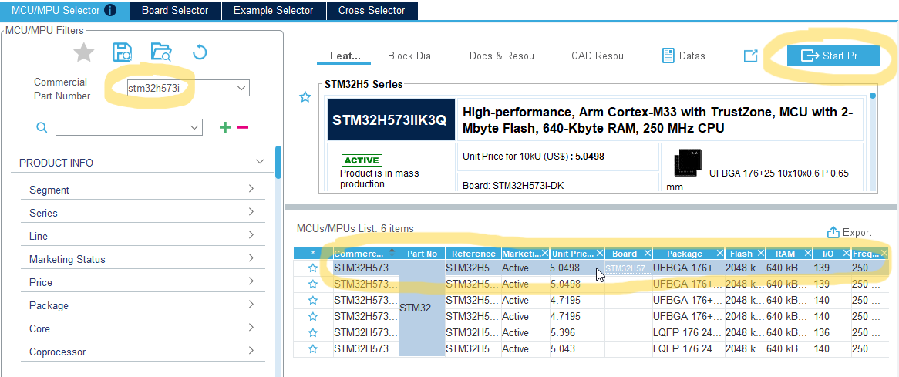

3) Click **Yes** for MPU default settings.


4) Select "**With TrustZone activated**" and click **OK**.  


5) In the **Pinout & Configuration** view, configure **PI1** pin as GPIO output push/pull and add **User Label** "GREEN_LED". Assign the pin to the **non-secure** world.

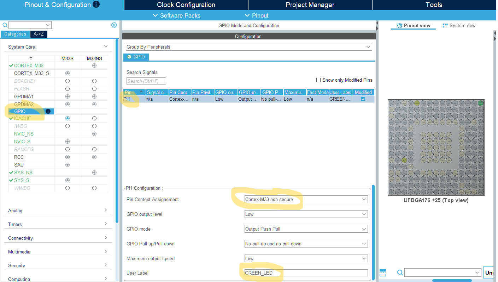

6) Set **HCLK** to maximum frequency **250** MHz. Just put value 250 in HCLK box, confirm by pressing enter and let the **STM32CubeMX** do the job to find the solution.
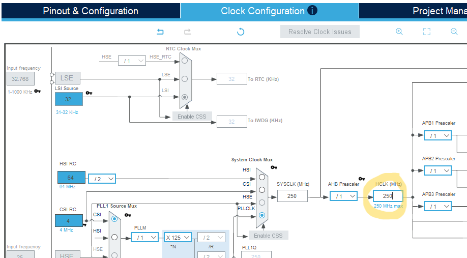

7) Give the project some name and don't forgot to **uncheck** "**Generate Under Root**" (this is required by TouchGFX project which will be added later. TouchGFX generator needs to touch .cprojet file and if generated under root, TouchGFX will not find that project file resulting in an error after code generation in TouchGFX Designer). As a toolchain select **STM32CubeIDE**. Click the button **Generate Code**.
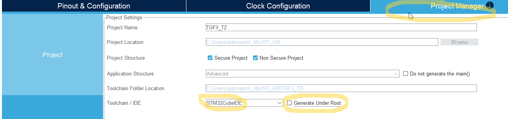

## Open the project in STM32CubeIDE

The STM32CubeMX creates hiearchical project with root project with the given name and two subprojects with given name and _Secure and _NonSecure suffixes.

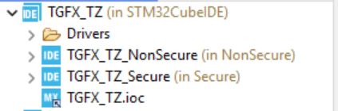

1) Add the lines of code making LED blinking in **Non-Secure** **main.c**.
```cpp
int main(void)
{
...
  /* USER CODE BEGIN WHILE */
  while (1)
  {
	  HAL_GPIO_TogglePin(GREEN_LED_GPIO_Port, GREEN_LED_Pin);
	  HAL_Delay(250);
    /* USER CODE END WHILE */

    /* USER CODE BEGIN 3 */
  }
  /* USER CODE END 3 */
}
```
2) Press **Ctrl + B** to build all, no errors should appear.

### Setup Debug

1) Click with **right mouse button** on _Secure project and select **Debug As** > **STM32 C/C++ Application**

2) In the **debug Configuration** click on **Startup** tab and add a **NonSecure image** in **Load Image and Symbols** list. Change **Build Configuration** to **Debug** for NonSecure project. Keep the rest untouched.


The application boots in a secure state when ***TrustZone®*** is enabled. The debugger sets the ***Program Counter*** using information from the last image in the ***Load image and Symbols*** table. Make sure the **Secure** image is **at the bottom** of the load list.


3) Click **OK** button to launch the debug session.

You should see the PC at **main.c** in **Secure** project. If you run the application (using **F8** key or **Play** button), the **Secure** code will execute and jump to **NonSecure** application and you should see the **LD6** blinking. This is to verify we have working **Secure** and **NonSecure** application setup and we are able to debug it.

When you run debug next time, be sure to select Secure project when launching debug.

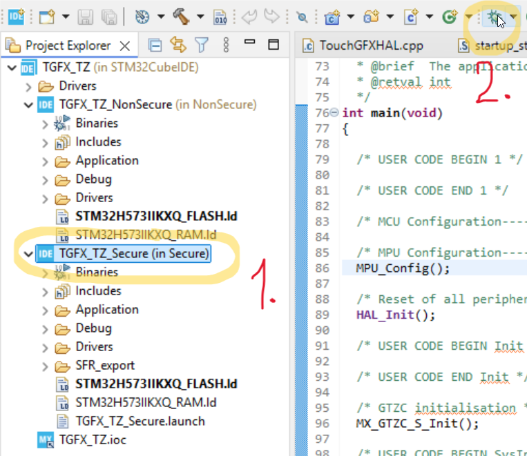

## Add TouchGFX SW packgage X-CUBE-TouchGFX

1) Go to **Software Packs** drop down menu and click **Select Components** option.
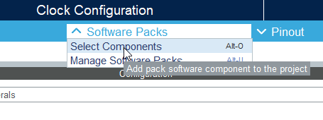

2) In the **Software Packs Component Selector** be sure to select **Cortex-M33 non secure** context because the **TouchGFX** can run only in **non secure** context.
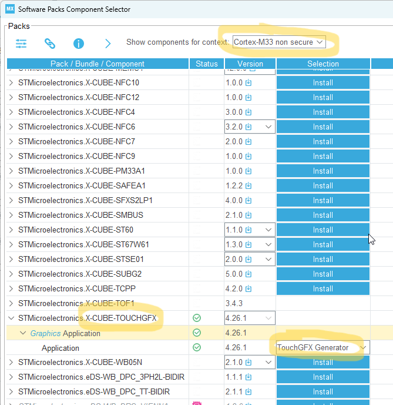

3) Then we need to activate **TouchGFX** middleware.
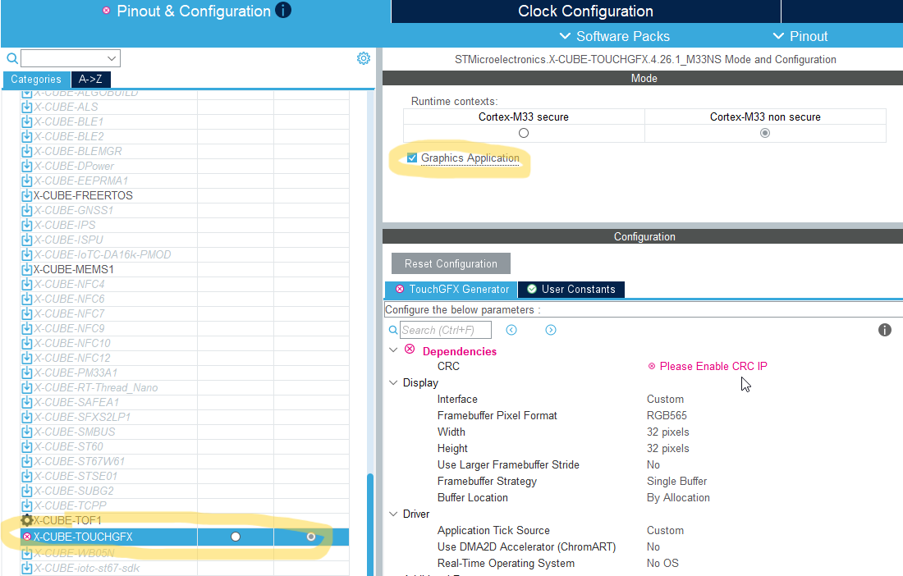

4) Solve the Dependencies error. The **TouchGFX** needs to have available **CRC** peripheral to proper function. You don't need to configure the **CRC** peripheral, just activate it using check box. **CRC** belongs to **non secure** context.
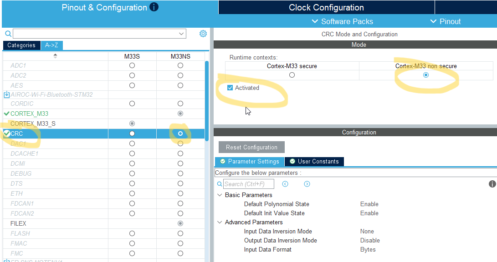

5) Activate the **FMC** for **non secure** context. The display on **STM32H573I-DK** board is connected with 16-bit data bus. To interface this display (Sitronix ST7789H2 controller) we can use **FMC** peripheral with LCD mode. Configure the **FMC** according to the pictures bellow. Disable the **Write FIFO**.
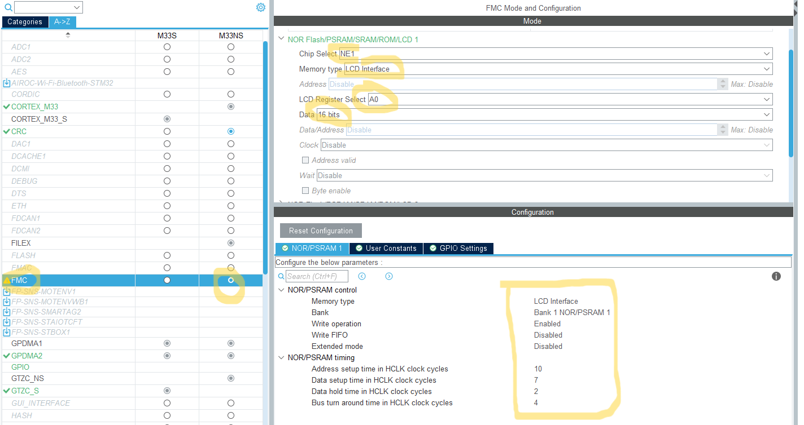

6) Check the **FMC** pin assignment according the picture bellow, sorted by **Signal name** (move pins to alternate position if needed to be inline with picture). All the pins, as **FMC** peripheral itself, belongs to the **non secure** context.
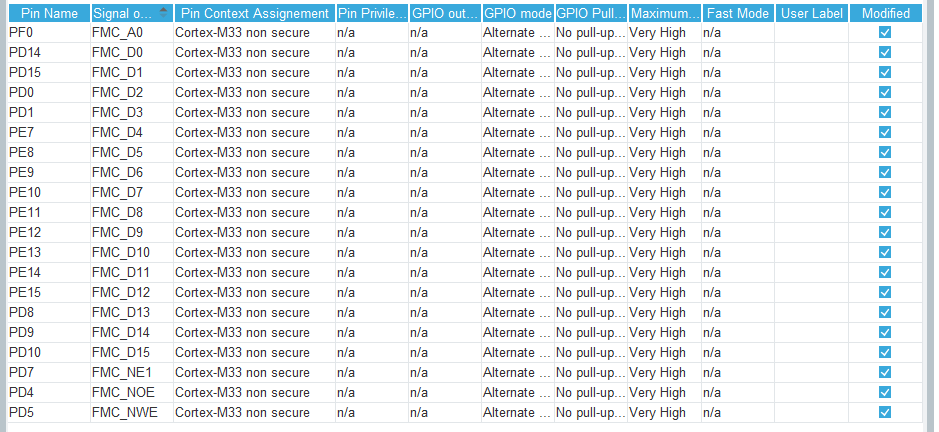

7) Adjust **TouchGFX** configuration in **STM32CubeMX**. Once we have activated the **FMC** controller, we can adjust configuration in the **STM32CubeMX** for **TouchGFX** middleware to use **FMC**. Set proper display size (240 x 240 px) and select **double frame buffer** - it will fit inside the internal SRAM (double FB size = 240 x 240 x 2 x 2 = 225 KB)
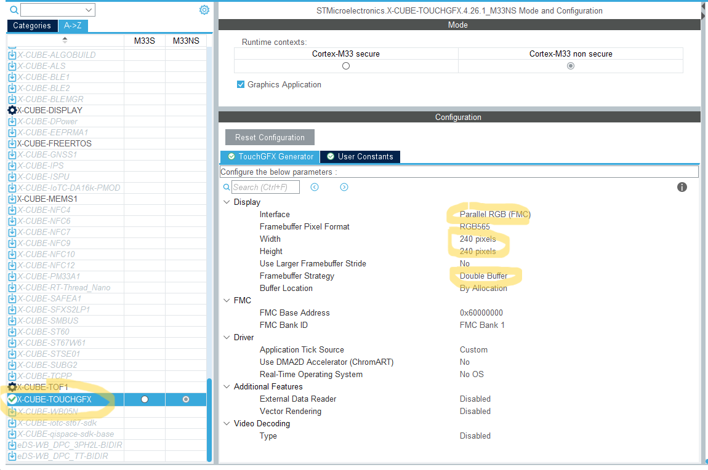

If you generate the project by **STM32CubeMX** now and then try to build the project, you will receive **expected errors**, because the project is **not complete**.

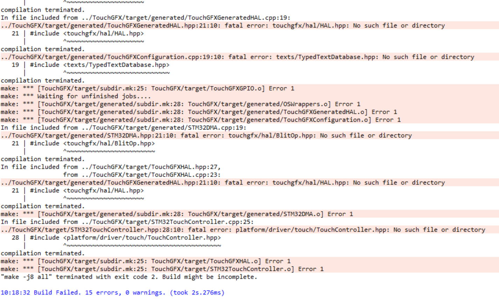

We must generate project in the **TouchGFX Designer** to have complete project.

## Generate TouchGFX project in the TouchGFX Designer

1) Open the **.touchgfx.part** partial project file located in /NonSecure/TouchGFX/:
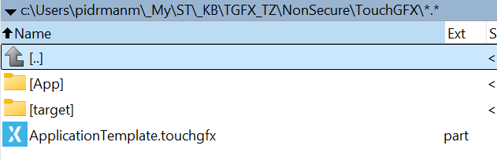

2) This will open the project in the ***TouchGFX Designer***. There you can select ***blank UI*** for initial project and click on ***Import*** button.
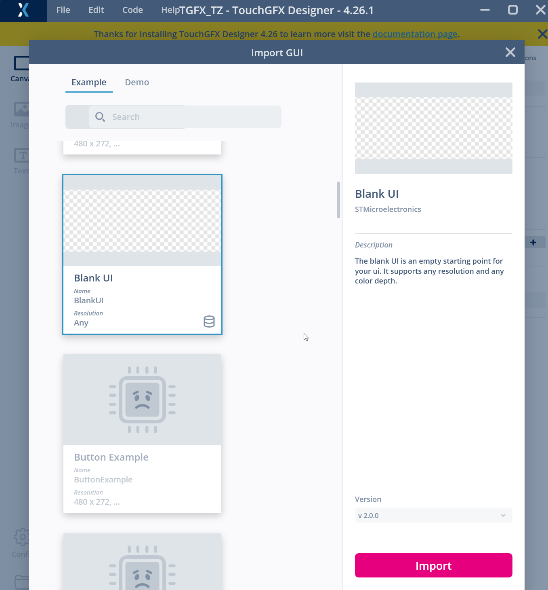

3) Add some basic shapes on the screen (canvas) to see at least something on the display later. You can put a white rectangle and spread it across all the screen to create a white background and then place somewhere a circle of any color.
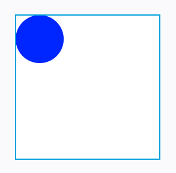

4) Now just click **Generate button** (or press F4) to generate **TouchGFX** project.
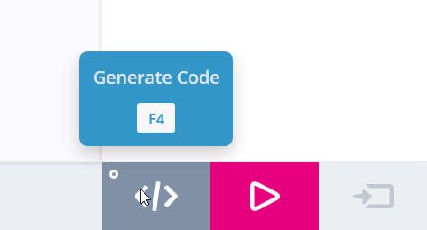

5) You should see green label at the bottom status bar informing about successfull generation.


At this point we are **able to build** the application **without any error**. If you start debugging, you will see running **TouchGFX** application. But the **TouchGFX** application will not be showing anything on the display and requires some more adjustments. 

Before we proceed further, **remove** or comment out **testing code** in the main.c (**non secure**) which blinks the green LED.

```cpp
...
  // HAL_GPIO_TogglePin(GREEN_LED_GPIO_Port, GREEN_LED_Pin);
  // HAL_Delay(250);
...
```

## GPIOs

We need to add some more **GPIOs** to handle display correctly. Configure the GPIO pins with the given **User Labels**.

1) The pin enabling power to display **PC6** (with label "**LCD_DISP**") - GPIO **output** push/pull. Default **GPIO output level** **Low** means the display will have a power just after initialization of this pin.

2) **Input** pin catching tearing effect (TE) signal from the display **PD3** (put there label "**LCD_TE**"). We need to enable **GPIO_EXTI3** on this pin to catch interrupts from the display TE pin. (**TouchGFX** rendering is triggered by this signal)
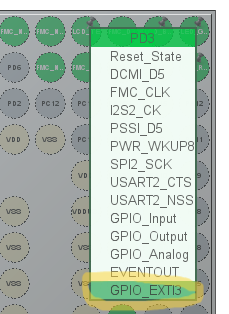 
Then go to **NVIC_NS** settings and enable interrupts on **EXTI line 3** by clicking on the checkbox.
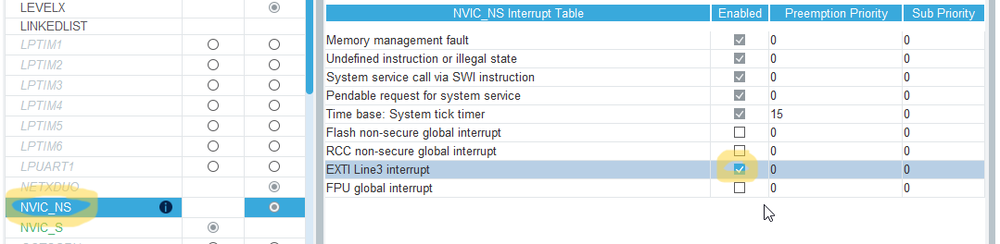

3) The pin controlling the display reset line **PH13** (with label "**LCD_RESET**"). GPIO **output** push/pull with **GPIO output level** **High**.

4) The pin controlling the backlight **PI3** (with label "**LCD_BL_CTRL**"). GPIO **output** push/pull with **GPIO output level** **High** which means that after the pin initialization the display backlight will be on.

See the summary bellow:
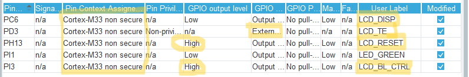

## Adjust avaliable heap and stack size

TouchGFX application would require more RAM memory than default values for heap and stack size. Enlarge stack and heap size for non-secure application in STM32CubeMX Project Manager.

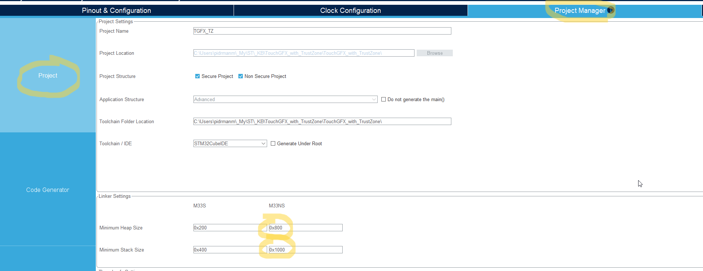

Be aware that if you modify the linker file manually in the linker file then it will be re-generated (reverted) to default values when you re-generate the project in the STM32CubeMX.

## MPCWM settings in GTZC (Global TZ Controller)

By default all externall memories address ranges are allocated for secure world. The FMC Bank1 address space will not be working until we enable the access for non-secure application. To enable it we need to configure MPCWM (Memory Protection Controller - Watermark Based) in STM32CubeMX under GTZC_S section.

We need to set the very beginning of the **FMC bank 1** address space attribute to **not secure**. The minimum not zero size is 0x20000, let's use this value for **MPCWM2 (FMC_NOR)** and **Area 1**. Check the picture bellow.
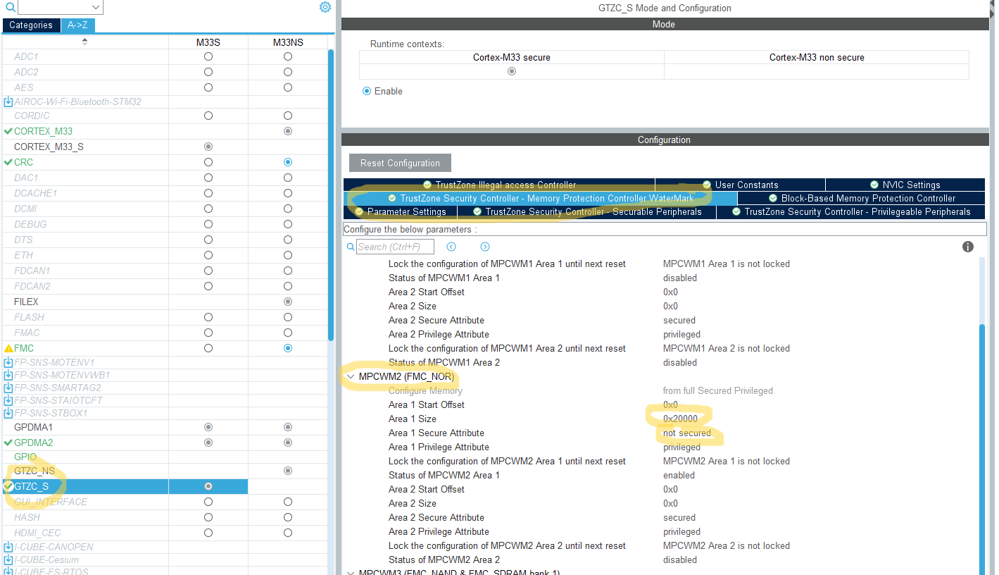

## GPDMA settings

**GPDMA2** is used to offload CPU when the FB is transfered to the GRAM of the display through the **FMC** interface. Just select the **GPDMA2 channel 6**. It is enough to activate it. All the configuration is done in the code we will add later.

And one more thing: You need to change the **GPDMA channel 6** security attribute to "**Priviledged**"...

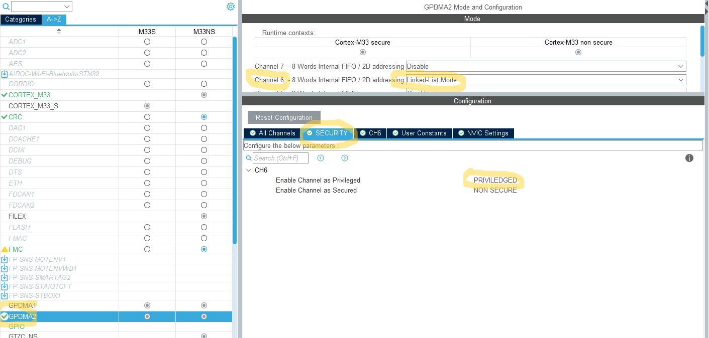

... and enable NVIC interrupt for GPDMA2 CH6.

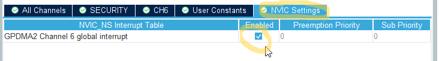

**Generate the project** again in STM32CubeMX.

## Add needed source code

Finally we must add a source code in the **TouchGFXHAL.cpp**
```
 c:\....\[your prj name]\NonSecure\TouchGFX\target\TouchGFXHAL.cpp
 ```
 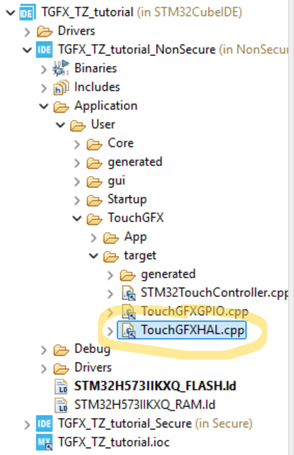

 To make things easier here, replace all the content of your **TouchGFXHAL.cpp** with the content from this repository:

 [TouchGFXHAL.cpp](NonSecure/TouchGFX/target/TouchGFXHAL.cpp)

Build the application (Ctrl + B) in CubeIDE and launch debug or flash the application.

**Reminder**: *Don't forget to select firstly **Secure project** before clicking bug icon to launch debug session.* [see here](README.md#setup-debug)

---
### Now you should see finally your screen layout on the display.

---

Note:
> By default (default STM32CubeMX settings) a huge portion of SRAM memory is allocated for **secure** application which is unnecesary and rest of available SRAM for **non-secure** application. The allocated SRAM for **secure** application can be reduced allowing more SRAM to be allocated to **non-secure** application (by adjusting linker file and **Block-Based Memory Protection Contrloller** tab in STM32CubeMX in **GTZC_S** section).