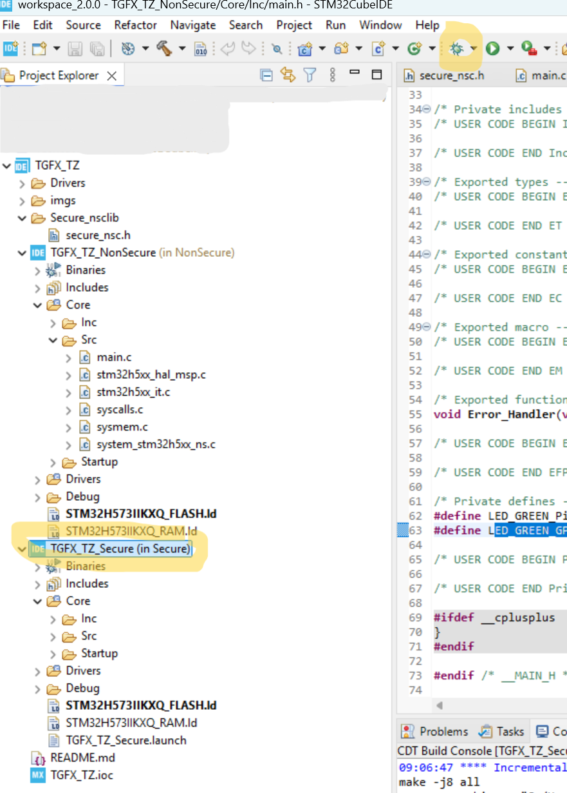

# Create and debug TouchGFX application with in Secure and Non-Secure project setup

- STM32CubeMX(1)
- STM32CubeIDE
- STM32H573I-DK

## Configure the Option Bytes

At first, it is needed to prepare STM32H5 device and configure its ***Option Bytes*** to be able to run secure and non-secure application.

1) Connect the board to the PC.
2) Open STM32CubeProgrammer GUI.
3) Connect to the STM32H573.
3) Activate TZ (TrustZone®) ***TZEN*** == B4 and ***Flash Water Mark*** for Flash ***Bank 1*** (Secure) and ***Bank2*** (Non-Secure)


## Create a new project using STM32CubeMX


Configure PI1 pin as GPIO output push/pull and add User Label "GREEN_LED":


Give the project some name and don't forgot to **uncheck** "Generate Under Root" (this is required by TouchGFX project which will be added later. TouchGFX generator needs to touch .cprojet file and if generated under root, TouchGFX will not find that project file):


## Open the project in STM32CubeIDE

Add these lines in Non-Secure main.c which make the green LED blink:

```cpp
int main(void)
{
...
  /* USER CODE BEGIN WHILE */
  while (1)
  {
	  HAL_GPIO_TogglePin(LED_GREEN_GPIO_Port, LED_GREEN_Pin);
	  HAL_Delay(250);
    /* USER CODE END WHILE */

    /* USER CODE BEGIN 3 */
  }
  /* USER CODE END 3 */
}
```

### Setup Debug


The application boots in a secure state when ***TrustZone®*** is enabled. The debugger sets the ***Program Counter*** using information from the last image in the ***Load image*** and ***Symbols*** table. Make sure the **secure** image is **at the bottom** of the load list.


When you run debug next time, be sure to select Secure project when launching debug.



If you run the application you should see the LD6 blinking.

## Add TouchGFX SW packgage X-CUBE-TouchGFX


Solve the Dependencies error. The TouchGFX needs to have available CRC peripheral to proper function. You don't need to configure the CRC peripheral, just activate it using check box.


If you generate by CubeMX the project now (just enabling TouchGFX and CRC) and then try to build the project, you will receive an errors, because the project is not complete.


We must generate project in the TouchGFX Designer to have complete project.

1) Open the .touchgfx.part partial project file located in /NonSecure/TouchGFX/:
