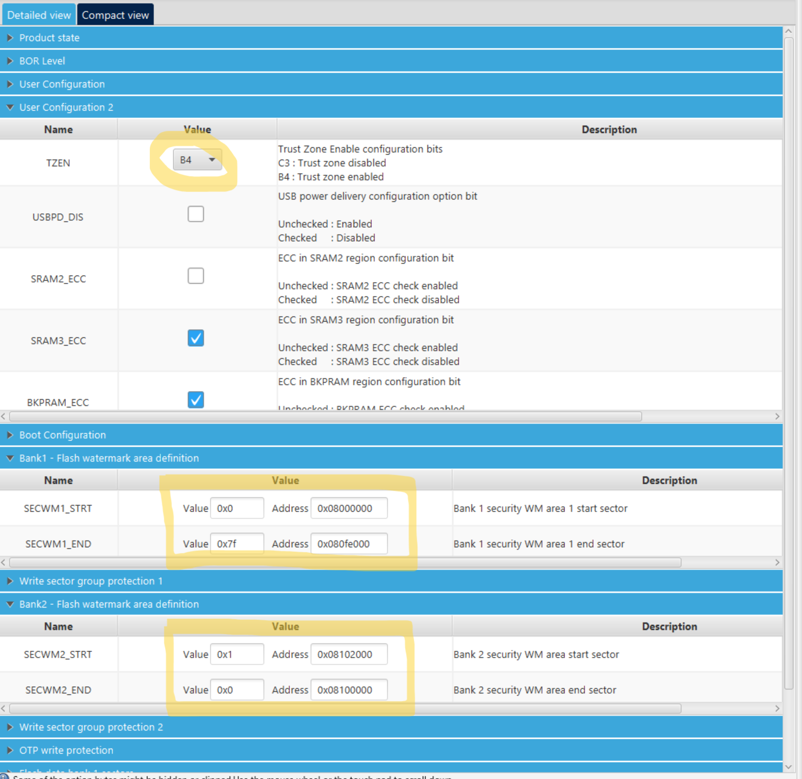
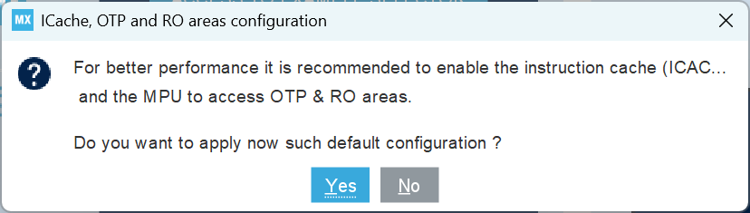
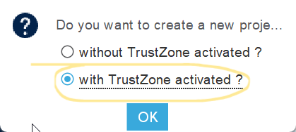
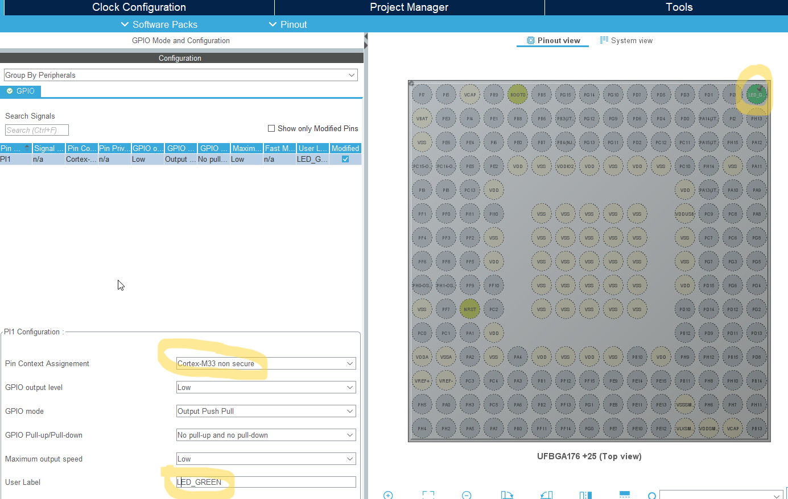
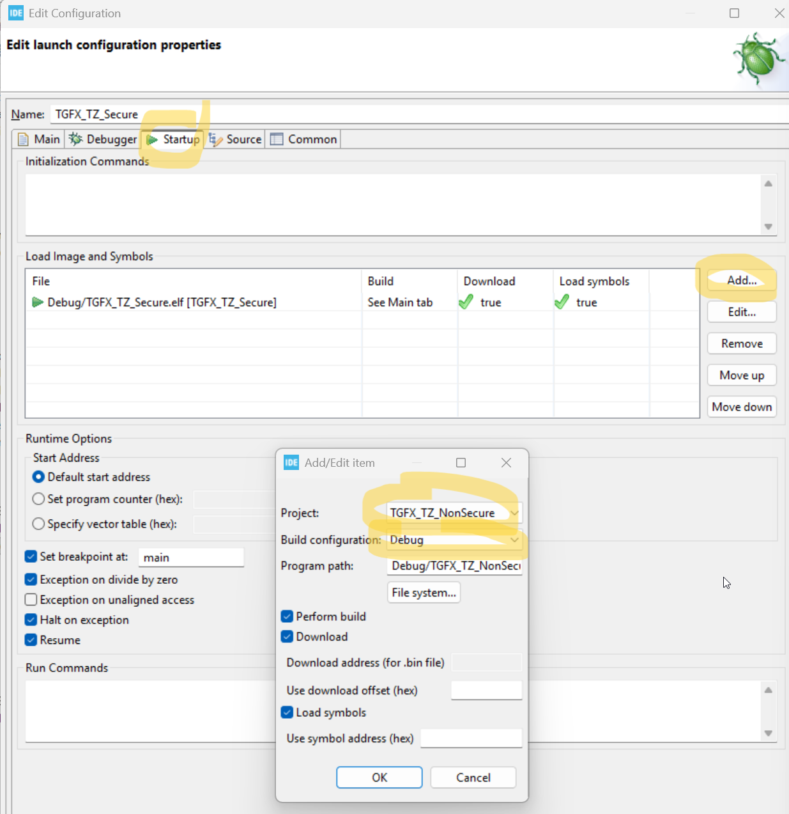
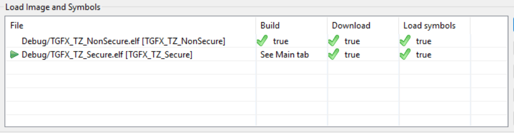

# Create and debug TouchGFX application with in Secure and Non-Secure project setup

- STM32CubeMX(1)
- STM32CubeIDE
- STM32H573I-DK

## Configure the Option Bytes

At first, it is needed to prepare STM32H5 device and configure its ***Option Bytes*** to be able to run secure and non-secure application.

1) Connect the board to the PC.
2) Open STM32CubeProgrammer GUI.
3) Connect to the STM32H573.
3) Activate TZ (TrustZone®) ***TZEN*** == B4 and ***Flash Water Mark*** for Flash ***Bank 1*** (Secure) and ***Bank2*** (Non-Secure)

## Create a new project using STM32CubeMX

## Open the project in STM32CubeIDE

### Setup Debug

STM32H5 Series devices always boot in secure state when ***TrustZone®*** is enabled. The debugger sets the ***Program Counter*** using information from the last image in the ***Load image*** and ***Symbols*** table. Make sure the **secure** image is **at the bottom** of the load list.

